# Lab 0 - Introducción a Verilog, Simulación y Máquinas de Estados Finitos (FSM)

<hr style="height: 4px; border: none; background-color: #c0f0f4;">

### Integrantes 2026 - 2

**Grupo 4**

- Ana Lucía Molina López - 1061697969
- Nicolás Ramírez González - 1023371323
- Diana Margarita Castillo - 1011201869

## Índice

- [Lab 0 - Introducción a Verilog, Simulación y Máquinas de Estados Finitos (FSM)](#lab-0---introducción-a-verilog-simulación-y-máquinas-de-estados-finitos-fsm)
    - [Integrantes 2026 - 2](#integrantes-2026---2)
  - [Índice](#índice)
  - [Punto 1](#punto-1)
    - [Diseño implementado](#diseño-implementado)
      - [Ana](#ana)
      - [Diana](#diana)
      - [Nicolás](#nicolás)
    - [Simulaciones](#simulaciones)
    - [Implementación](#implementación)
  - [Punto 2](#punto-2)
    - [Diseño implementado](#diseño-implementado-1)
      - [Ana](#ana-1)
      - [Diana](#diana-1)
      - [Nicolás](#nicolás-1)
    - [Simulaciones](#simulaciones-1)
    - [Implementación](#implementación-1)
      - [Ana](#ana-2)
      - [Diana](#diana-2)
      - [Nicolás](#nicolás-2)
  - [Punto 3](#punto-3)
    - [Diseño implementado](#diseño-implementado-2)
      - [Ana](#ana-3)
      - [Diana](#diana-3)
      - [Nicolás](#nicolás-3)
    - [Simulaciones](#simulaciones-2)
      - [Ana](#ana-4)
      - [Diana](#diana-4)
      - [Nicolás](#nicolás-4)
    - [Implementación](#implementación-2)
  - [Conclusiones](#conclusiones)
  - [Código punto 1](#código-punto-1)
  - [Código punto 2](#código-punto-2)
  - [Código punto 3](#código-punto-3)

## Punto 1

### Diseño implementado

Cada uno hizo un diseño diferente, pero el que se va a implementar en Verilog será el de Nicolás.

#### Ana


**Figura 1.** FSM.

> Si el reset vale 1, regresa al estado `S0`.

Para este se realizaron las tablas de transición, que se pueden encontrar [aquí](https://docs.google.com/spreadsheets/d/1C5YlcoK99f4i70GjKSwNL7btG8Hh6j6SiFM0LFeSxWA/edit?usp=sharing "Hoja de cálculo de Google con las tablas de transición") y además se simuló el circuito en [Circuitverse](https://circuitverse.org/users/397629/projects/secuencial-feee2124-a29d-4914-8d60-471e157a33a3/simulator/embed "Circuito laboratorio 0 punto 1").

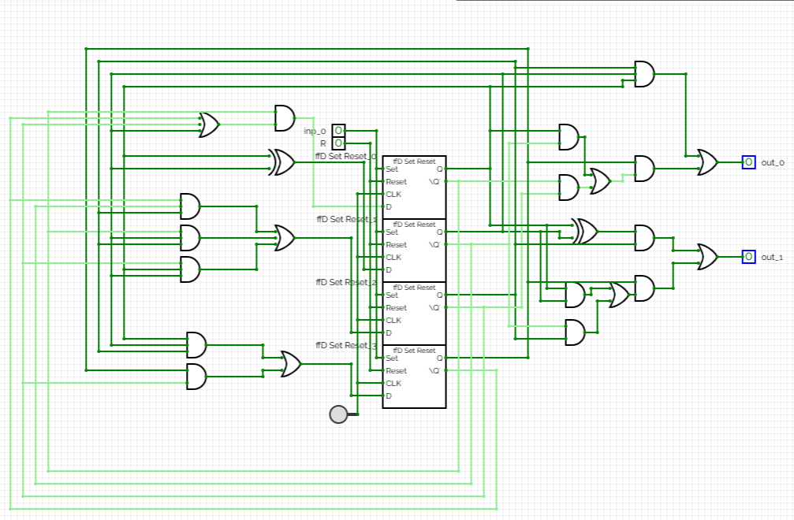


#### Diana

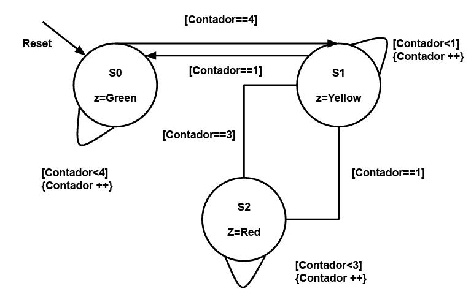

Las señales obtenidas con este [código](codigos/punto1/Mar/) fueron:

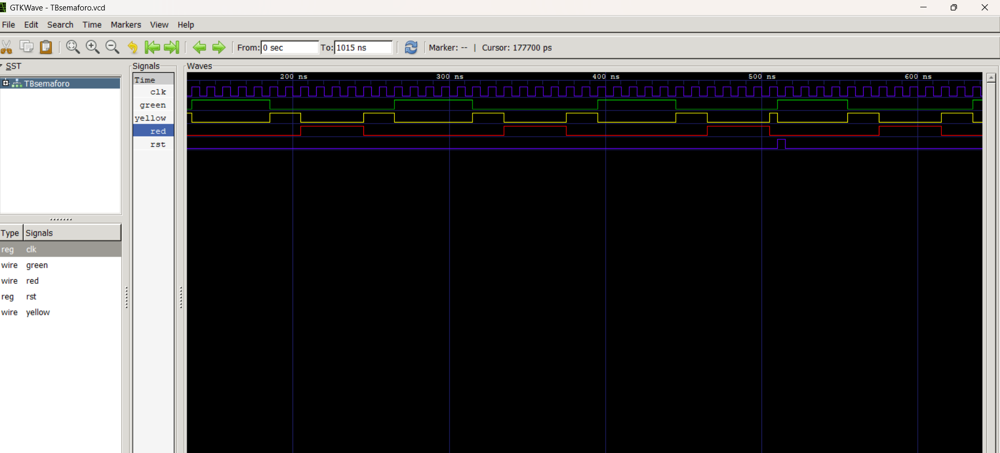


#### Nicolás

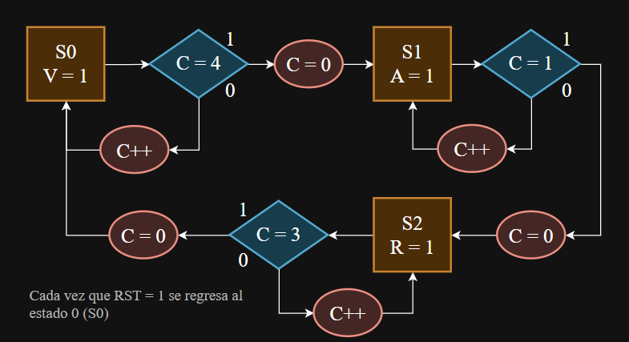

**Figura 3.** ASM.

> Si el reset vale 1, entonces se devuelve al estado 0 y la cuenta `C = 0`.


### Simulaciones

Se realizó una simulación en Verilog mediante un testbench.

El testbench genera una señal de reloj periódica y aplica la señal de reset al inicio de la simulación para llevar el circuito a su estado inicial. Luego, el sistema avanza de manera sincronizada con el reloj, lo que permite observar la activación de las diferentes salidas.

Se observan las señales:

`CLK`: señal de reloj utilizada para sincronizar el funcionamiento del circuito.

`reset`: señal utilizada para inicializar el sistema.

`Rojo`: salida del estado rojo, que permanece activa durante 4 unidades de CLK.

`Verde`: salida del estado verde, que permanece activa durante 5 unidades de CLK.

`Amarillo`: salida del estado amarillo, que permanece activa durante 2 unidades de CLK.

La captura de GTKWave muestra el comportamiento temporal de las señales y permite evidenciar las transiciones entre los estados.

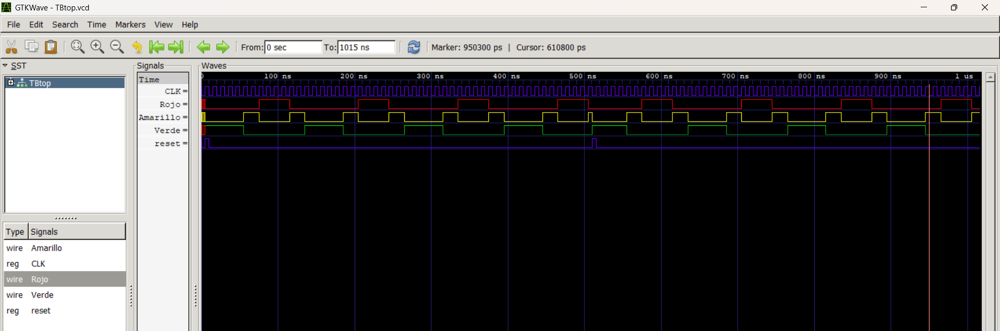


### Implementación

El sistema es una máquina de estados secuencial que interactúa con un reloj (contador interno) `CLK`.

Primero se definieron 3 estados principales: S0, S1 y S2; luego se especificaron las salidas de cada estado y qué señal binaria se activa:

- En S0: `V = 1`
- En S1: `A = 1`
- En S2: `R = 1`

Además, se agregó un registro de control `C`, un contador que se incrementa en 1 o se reinicia a `C = 0`.

Cada estado se comporta de manera autónoma durante un ciclo de reloj y se puede mapear directamente dentro de un bloque always @(*) para la lógica de transición o en las asignaciones de registros.

El código está en la parte de abajo y en la carpeta códigos.


## Punto 2

### Diseño implementado

Para este se dividió el punto entre los 3 integrantes, cada uno encargado de realizar una secuencia:

#### Ana

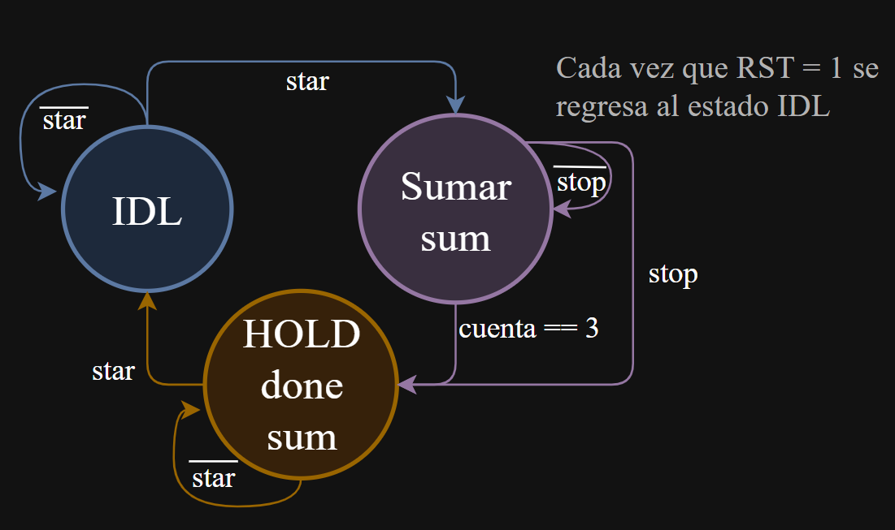


#### Diana

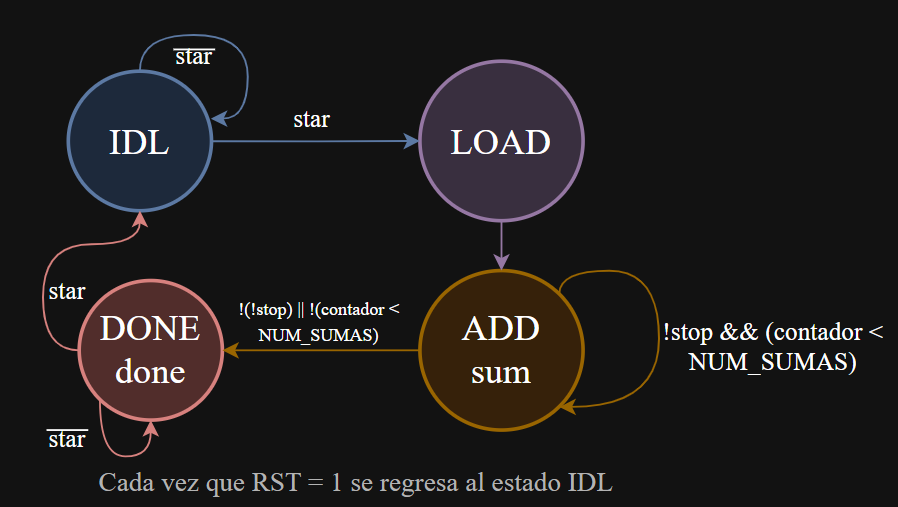

#### Nicolás

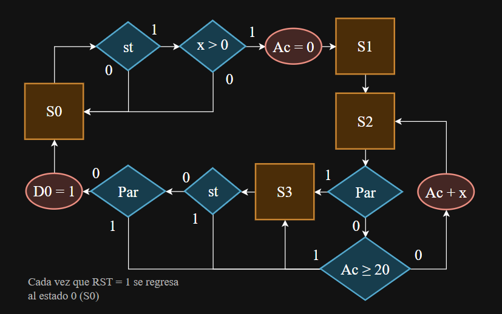

### Simulaciones

Se realizó una simulación en Verilog mediante un testbench.

Se observan las señales:

`CLK`: señal de reloj utilizada para sincronizar el funcionamiento del circuito.

`reset`: señal utilizada para reiniciar el sistema.

`start`: señal utilizada para inicializar el sistema.

`x`: entrada de 4 bits que será el número a sumar cierta cantidad de veces.

`acumulado`: salida del resultado de sumar `x` cierta cantidad de veces.

`operacion`: entrada de 2 bits, que selecciona cuál de las 3 operaciones se quiere hacer.

> Si `operacion = 00` entonces el número de entrada `x` se sumará 3 veces.

> Si `operacion = 01` entonces el número de entrada `x` se sumará 4 veces.

> Si `operacion = 10` entonces el número de entrada `x` se sumará hasta que el acumulador `acumulado` sea `acc ≥ 20`.

`parar`: señal que frena la suma y deja el resultado en el ciclo en el que se haya quedado.

`done`: salida que indica que ya se ha terminado la operación.

La captura de GTKWave muestra el comportamiento temporal de las señales con `x = 5` y luego `x = 3`.

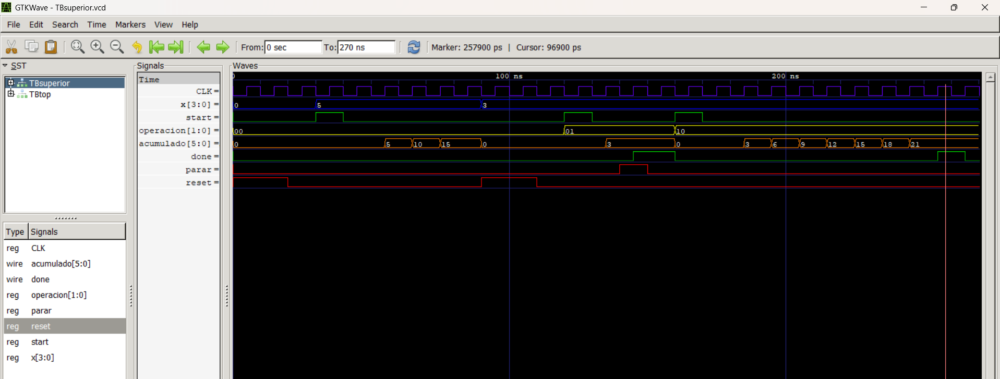


### Implementación

El sistema es una máquina de estados secuencial que interactúa con un reloj (contador interno) `CLK`.

Primero se identificaron las salidas y entradas y los parámetros que afectarían a todos los casos (`start`, `stop` y `done`); luego nos dividimos y cada uno hizo una operación diferente:

#### Ana

- Operación 01

Se usaron 3 estados:

- IDL: estado donde, además de limpiar parámetros (como `sum = 0`, `acumulador = 0`...), se espera una señal `start = 1` para poder continuar a SUMAR.
- SUMAR: si no se ha presionado `stop = 1` y `cuenta` es diferente de 3, entonces se suma, se muestra, se aumenta `cuenta` y se actualiza el `acumulador`. En caso contrario (si `stop = 1` o `cuenta == 3`) se guarda el `acumulador`, se manda la señal de finalización y pasa al siguiente estado `HOLD`.
- HOLD: se va a mantener aquí hasta que `start = 1` o `reset = 1`.

La suma se va a mostrar en cada ciclo, que será la salida del estado `SUMAR`, además del `done = 1`.


#### Diana

- Operación 00

Para esta operación, se hizo algo parecido a la anterior, solo que aquí se agregó un estado de más para asegurar la limpieza en un ciclo de reloj dedicado justo después de recibir `start = 1`. Esto asegura que las sumas en `ADD` comiencen desde cero y evita falsos disparos o acumulación sobre valores previos al reiniciar el ciclo:

- IDLE: estado de reposo donde se mantiene el `done = 0` y se espera la señal `start`.
- LOAD: encargado exclusivamente de limpiar los registros (`acc = 0` y `contador = 0`) para garantizar un punto de partida limpio antes de procesar.
- ADD: aquí, en cada ciclo de reloj, suma el valor de `x`, incrementa el contador y evalúa las salidas: avanza a `DONE` si se activa `stop = 1` o si se alcanzan las 3 sumas (`contador == 3`).
- DONE: activa `done = 1` y congela el resultado final en la salida hasta que se ordene un nuevo reinicio o un nuevo inicio con `start = 1`.

#### Nicolás

- Operación 10

Esta operación, a diferencia de las otras dos, suma el valor de x en bucle hasta alcanzar un límite de valor `acumulado ≥ 20` o hasta que se active la señal `parar`.

Consta de 4 estados:

- Estado 0: espera `start = 1` y `x > 0`, además limpia el `acumulado = 0` y avanza al siguiente estado.
- Estado 1: estado de transición de 1 ciclo que pasa automáticamente al estado 2.
- Estado 2: aquí se suma `x` repetidamente a `acumulado` hasta que se activa `parar = 1` o el total llega a `≥ 20`, pasando al estado 3.
- Estado 3: activa `done = 1` y congela el resultado final hasta que `start = 0` y `parar = 0`.

Cada uno es un archivo separado, que se llaman desde uno solo: [Superior](codigos/punto2/Superior.v).

En ese archivo se va a agregar un selector de operación (`operacion`), con el cual el usuario puede elegir alguno de los 3 acumuladores.


El código está en la parte de abajo y en la carpeta códigos.


## Punto 3

### Diseño implementado

Cada uno hizo su diseño, pero al ser el ejercicio muy específico, se llegó a casi lo mismo.

El único cambio notable fue que en uno se usó el `bit_count` para recorrer `shift_reg`, mientras que en otro se usó `>>1`.

#### Ana

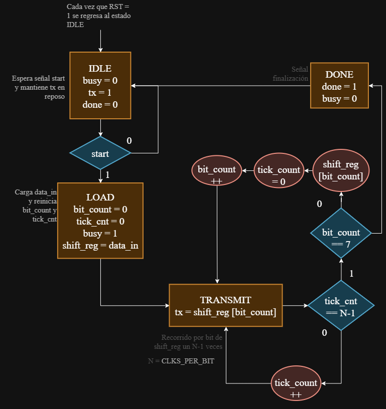


#### Diana


#### Nicolás

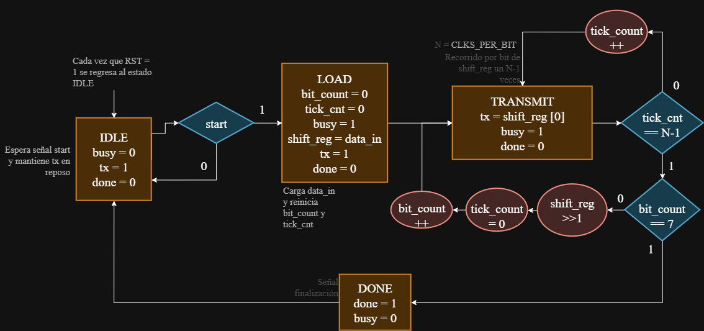

### Simulaciones

Se realizó una simulación en Verilog mediante un testbench.

Para este último caso tenemos las siguientes señales:

`clk`: señal de reloj utilizada para sincronizar el funcionamiento del circuito.

`rst`: señal utilizada para inicializar el sistema.

`start`: señal utilizada para inicializar el sistema.

Los 4 diferentes estados: `IDLE`, `LOAD`, `TRANSMIT` y `DONE`.

`data_in` y `shift_reg`: que son el número de entrada y su copia.

`bit_count` = un contador que va de 0 a 7, representando el tamaño del bit que entra.

`tick_cnt` = un contador de tamaño `$clog2(CLKS_PER_BIT)-1`, el cual se encarga de mantener cada bit una cierta cantidad de ciclos.

`tx` = es el valor del bit actual y, además, cuando está en el estado `IDLE`, funciona como una línea de reposo.

`busy` = señal que indica cuándo se está transmitiendo.

`done` = salida que indica que ya se ha terminado la operación.

La captura de GTKWave muestra el comportamiento temporal de las señales y permite evidenciar las transiciones entre los estados.

#### Ana

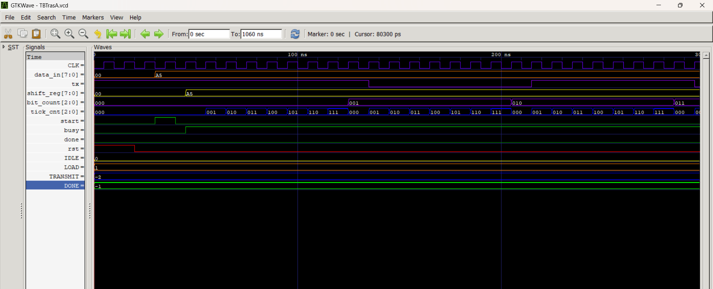

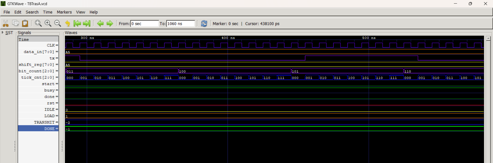

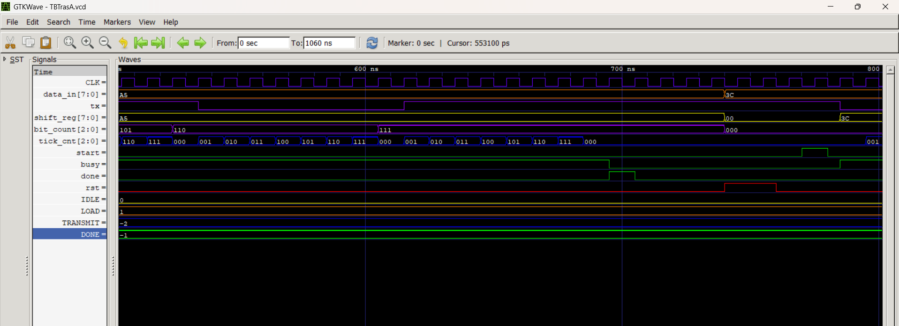

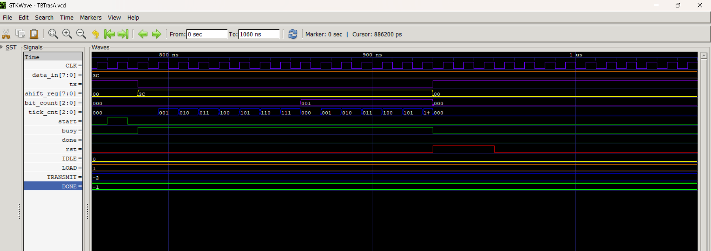


#### Diana


#### Nicolás

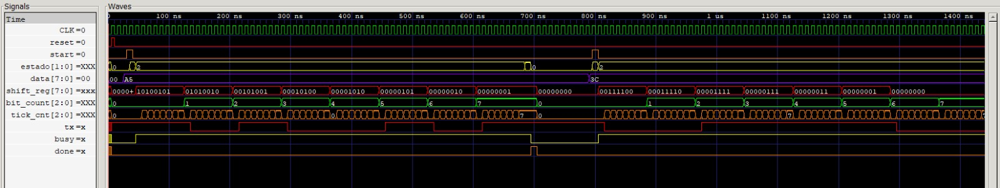


### Implementación

Tenemos una máquina de estados finitos algorítmica con 4 estados principales:

- IDLE = estado de reposo del transmisor. Aquí `busy` y `done` valen 0, la línea `tx` se mantiene en 1 (nivel alto) y todos los contadores y el registro de desplazamiento se limpian para dejar la máquina lista para una nueva transmisión. Permanece en este estado indefinidamente hasta que la señal `start` vale 1, momento en el que pasa a `LOAD`.
- LOAD = estado de preparación que dura un solo ciclo de reloj y cuya transición es incondicional. Se activa `busy = 1` para avisar que hay una transmisión en curso, se reinician `bit_count` y `tick_cnt` a 0 y se captura el valor de data en `shift_reg`, que es el byte que se va a enviar. La línea `tx` sigue en 1 porque todavía no se ha empezado a transmitir ningún bit, y al terminar el ciclo se pasa a `TRANSMIT`.
- TRANSMIT = estado principal, donde se envía el byte bit a bit empezando por el menos significativo. En cada ciclo, `tx` toma el valor de `shift_reg[0]`, y el contador `tick_cnt` cuenta de 0 a 7 para que cada bit se mantenga 8 ciclos de reloj en la línea. Cuando `tick_cnt` llega a 7, si aún no se han enviado los 8 bits se incrementa `bit_count`, se reinicia `tick_cnt` y se desplaza `shift_reg` un bit a la derecha para presentar el siguiente bit; si `bit_count` ya vale 7, significa que se envió el último bit y se pasa a `DONE`. En total este estado dura 64 ciclos (8 bits × 8 ciclos).
- DONE = estado de finalización y dura un solo ciclo. Aquí done se pone en 1, generando un pulso que indica que el byte se transmitió por completo, mientras que busy vuelve a 0 y `tx` regresa a 1 (línea en reposo). Los contadores y el registro de desplazamiento conservan su valor, y la transición a `IDLE` es incondicional, donde done vuelve a 0 y la máquina queda lista para una nueva transmisión.

El código está en la parte de abajo y en la carpeta códigos.

## Conclusiones

El primer problema se presentó durante la fase de instalación de Icarus Verilog. El software de protección detectó la versión más reciente del instalador como una falsa alerta de virus, por lo que se optó por descargar una versión anterior.

La práctica permitió refrescar y profundizar conocimientos clave en el desarrollo de hardware con Verilog, además de la implementación y el modelado de Máquinas de Estados Finitos (FSM) y ASM (Algorithmic State Machine).

Como ejercicio analítico complementario, se abordó el diseño clásico mediante el desarrollo manual de las tablas de transición para validar la lógica del circuito a nivel matemático antes de su codificación.

Se evidenció el rol del testbench en el diseño. Gracias a la simulación, se logró identificar a tiempo un error de lógica en el conteo de estados del primer punto: inicialmente, el contador se programó para iterar de 0 a 5, lo que introducía un ciclo de reloj excedente no deseado. La verificación de las formas de onda permitió corregirlo.


Otro error corregido fue el de la señal `stop`, en el ejercicio 2, pues a veces sumaba de más, siendo un problema de la simulación; en otro caso, no se verificaba en cada ciclo y pasaba derecho, dando la suma completa. En este punto en especial se tuvieron muchos problemas de simulación: si se metía mal un ciclo con `#`, se obtenían resultados erróneos.


## Código punto 1
```verilog
module Top (
    input CLK,
    input reset,
    output reg Verde,
    output reg Amarillo,
    output reg Rojo
);
    //wire CLK;
    reg [1:0] estado;
    reg [2:0] cuenta;

    always @(posedge CLK, posedge reset) begin
        if (reset) begin
            estado <= 2'd0;
            cuenta <= 3'd0;
        end
        else begin
            case (estado)
                2'd0: if (cuenta == 3'd4) begin
                    estado <= 2'd1;
                    cuenta <= 3'd0;
                end else cuenta <= cuenta + 3'd1;
                2'd1: if (cuenta == 3'd1) begin
                    estado <= 2'd2;
                    cuenta <= 3'd0;
                end else cuenta <= cuenta + 3'd1;
                2'd2: if (cuenta == 3'd3) begin
                    estado <= 2'd3;
                    cuenta <= 3'd0;
                end else cuenta <= cuenta + 3'd1;
                2'd3: if (cuenta == 3'd1) begin
                    estado <= 2'd0;
                    cuenta <= 3'd0;
                end else cuenta <= cuenta + 3'd1;
                default: begin
                    estado <= 2'd0;
                    cuenta <= 3'd0;
                end
            endcase
        end
    end

    always @(*) begin
        Verde = 1'b0;
        Amarillo = 1'b0;
        Rojo = 1'b0;
        case (estado)
            2'd0: Verde = 1'b1;
            2'd1: Amarillo = 1'b1;
            2'd2: Rojo = 1'b1;
            3'd3: Amarillo = 1'b1;
            default: begin
                Verde = 1'b1;
                Amarillo = 1'b0;
                Rojo = 1'b0;
            end
        endcase
    end
endmodule
```

## Código punto 2

```verilog
// Módulo que controla al resto: Selector de Operación / Acumuladores
//Multiplexación/Demultiplexación de submódulos

module Superior (
    input  wire       CLK,        // Reloj 
    input  wire       reset,      // Reset global
    input  wire       start,      // Señal de inicio multiplexada
    input  wire [3:0] x,          // Valor de entrada de 4 bits
    input  wire       parar,      // Parada de emergencia
    input  wire [1:0] operacion,  // Selector de submódulo (0, 1, 2)

    output reg  [5:0] acumulado,  // Resultado acumulado multiplexado
    output reg        done        // Bandera de finalización multiplexada
);

    // Habilitación individual de inicio
    reg  [3:0] conection;

    // Buses internos para capturar las salidas de los submódulos
    wire [5:0] acumulado0, acumulado1, acumulado2;
    wire       done0, done1, done2;

    
    //Demux de 'start' y Mux de salidas
    
    always @(*) begin
        conection = 4'd0;        // Valor por defecto
        case (operacion)
            // Operación 0 (y 3 por omisión): Activa 'Acc3' (acumulador_secuencial)
            2'd0, 2'd3: begin
                conection[0] = start;
                acumulado    = acumulado0;
                done         = done0;
            end

            // Operación 1: Activa 'Acc4' (Top2A)
            2'd1: begin
                conection[1] = start;
                acumulado    = acumulado1;
                done         = done1;
            end

            // Operación 2: Activa 'Acc20' (Top2 - límite 20)
            2'd2: begin
                conection[2] = start;
                acumulado    = acumulado2;
                done         = done2;
            end

            // Estado por defecto de seguridad
            default: begin
                conection = 4'd0;
                acumulado = 6'd0;
                done      = 1'b0;
            end
        endcase
    end

    // submódulos instanciados

    // Submódulo 0: Suma fija de 3 iteraciones
    acumulador_secuencial Acc3 (
        .clk   (CLK),
        .rst   (reset),
        .start (conection[0]),
        .x     (x),
        .acc   (acumulado0),
        .done  (done0),
        .stop  (parar)
    );

    // Submódulo 1: Acumulador variante A
    Top2A Acc4 (
        .CLK   (CLK),
        .start (conection[1]),
        .reset (reset),
        .stop  (parar),
        .x     (x),
        .sum   (acumulado1),
        .done  (done1)
    );

    // Submódulo 2: Acumulador por tope (>= 20)
    Top2 Acc20 (
        .CLK       (CLK),
        .reset     (reset),
        .start     (conection[2]),
        .parar     (parar),
        .x         (x),
        .acumulado (acumulado2),
        .done      (done2)
    );

endmodule
```
## Código punto 3

```verilog
module Top3 (
    input CLK,
    input reset,
    input start,

    input [7:0] data,

    output reg tx,
    output reg busy,
    output reg done
);
    parameter N = 8;
    parameter CLKS_PER_BIT = N;

    reg [7:0] shift_reg;
    reg [2:0] bit_count;
    reg [$clog2(CLKS_PER_BIT)-1:0] tick_cnt;

    reg [1:0] estado;

    localparam IDLE = 2'd0;
    localparam LOAD = 2'd1;
    localparam TRANSMIT = 2'd2;
    localparam DONE = 2'd3;

    always @(posedge CLK, posedge reset) begin
        if (reset) begin
            busy <= 0;
            done <= 0;
            tx = 1;
            shift_reg <= 0;
            bit_count <= 0;
            tick_cnt <= 0;
            estado <= 0;
        end else begin
            case (estado)
                IDLE: begin
                    busy <= 0;
                    done <= 0;
                    tx <= 1;
                    bit_count <= 0;
                    shift_reg <= 0;
                    tick_cnt <= 0;
                    if (start) estado <= LOAD;
                end
                LOAD: begin
                    busy <= 1;
                    done <= 0;
                    tx <= 1;
                    bit_count <= 0;
                    shift_reg <= data;
                    tick_cnt <= 0;
                    estado <= TRANSMIT;
                end
                TRANSMIT: begin
                    busy <= 1;
                    done <= 0;
                    tx <= shift_reg[0];
                    if (&tick_cnt) begin
                        if (bit_count == 3'd7) estado <= DONE;
                        else begin
                            bit_count <= bit_count + 3'd1;
                            tick_cnt <= 0;
                            shift_reg = shift_reg >> 1;
                        end
                    end else tick_cnt = tick_cnt + 3'd1;
                end
                DONE: begin
                    busy <= 0;
                    done <= 1;
                    tx <= 1;
                    bit_count <= bit_count;
                    shift_reg <= shift_reg;
                    tick_cnt <= tick_cnt;
                    estado <= IDLE;
                end
            default: begin 
                busy <= 0;
                done <= 0;
                tx <= 1;
                bit_count <= 0;
                shift_reg <= 0;
                tick_cnt <= 0;
                estado <= IDLE;
            end
            endcase
        end
    end
endmodule
```