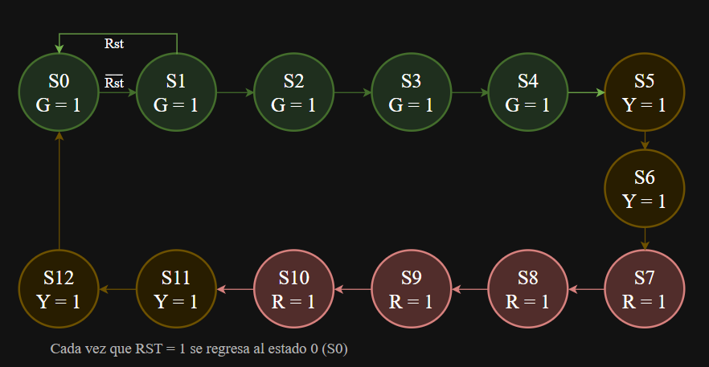
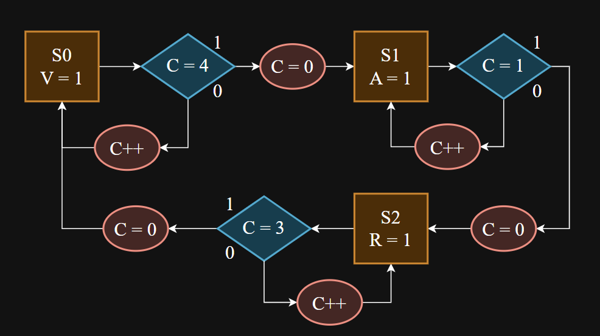
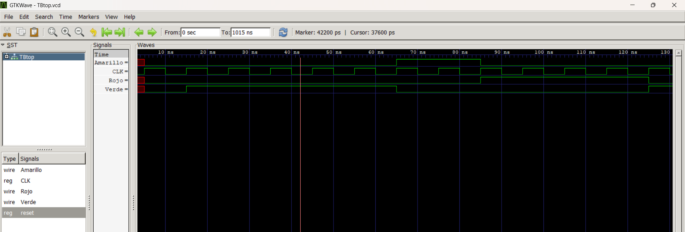

# Lab 0 - Introducción a Verilog, Simulación y Máquinas de Estados Finitos (FSM)

<hr style="height: 4px; border: none; background-color: #c0f0f4;">

### Integrantes 2026 - 2

**Grupo 4**

- Ana Lucía Molina López - 1061697969
- Nicolás Ramírez González - 1023371323
- Diana Margarita Castillo - 1011201869

## Índice

- [Lab 0 - Introducción a Verilog, Simulación y Máquinas de Estados Finitos (FSM)](#lab-0---introducción-a-verilog-simulación-y-máquinas-de-estados-finitos-fsm)
    - [Integrantes 2026 - 2](#integrantes-2026---2)
  - [Índice](#índice)
  - [Punto 1](#punto-1)
  - [Diseño implementado](#diseño-implementado)
    - [Ana](#ana)
    - [Diana](#diana)
    - [Nicolás](#nicolás)
  - [Simulaciones](#simulaciones)
  - [Implementación](#implementación)
  - [Conclusiones](#conclusiones)
  - [Códigos](#códigos)

## Punto 1

## Diseño implementado

Cada uno hizo un diseño diferente, pero el que se va a implementar en Verilog será el de Nicolás.

### Ana



**Figura 1.** FSM.

> Si el reset vale 1, regresa al estado `S0`.

### Diana

### Nicolás



**Figura 3.** ASM.

> Si el reset vale 1, entonces se devuelve al estado 0 y la cuenta `C = 0`.

## Simulaciones

Se realizó una simulación en Verilog mediante un testbench. 

El testbench genera una señal de reloj periódica y aplica la señal de reset al inicio de la simulación para llevar el circuito a su estado inicial. Para que luego, el sistema avance de manera sincronizada con el reloj, observando la activación de las diferentes salidas.

Se observan las señales:

`CLK`: señal de reloj utilizada para sincronizar el funcionamiento del circuito.

`reset`: señal utilizada para inicializar el sistema.

`Rojo`: salida estado rojo, que permanece activo durante 4 unidades de CLK.

`Verde`: salida  estado verde, permanece activo durante 5 unidades de CLK.

`Amarillo`: salida estado amarillo, que permanece activo durante 2 unidades de CLK.

La captura de GTKWave muestra el comportamiento temporal de las señales y permite evidenciar las transiciones entre los estados.




## Implementación

El sistema es una máquina de estados secuencial que interactúa con un reloj (contador interno) `CLK`.

Primero se defienieron 3 estados principales: S0, S1 y S2, luego se especificaron las salidas de cada estado y que señal binaria ese activa:

- En S0: `V = 1` 
- En S1: `A = 1`
- En S2: `R = 1`
  
Además se agregó un registro de control `C`, un contador que se incrementa en 1 o se reinicia  a `C = 0`. 

Cada estado se comporta de manera autónoma durante un ciclo de reloj y se puede mapear directamente dentro de un bloque always @(*) para la lógica de transición o en las asignaciones de registros.

El código está en la parte de abajo y el la carpeta códigos.

## Conclusiones

El primer problema se presentó durante la fase de instalación de Icarus Verilog. El software de protección detectó la versión más reciente del instalador como una falsa alerta de virus. Por lo que se optó por descargar  una versión anterior. 

La práctica permitió refrescar y profundizar conocimientos clave en el desarrollo de hardware con Verilog, además de la implementación y modelado de Máquinas de Estados Finitos (FSM) y ASM (Algorithmic State Machine).

Como ejercicio analítico complementario, se abordó el diseño clásico mediante el desarrollo manual de las tablas de transición para validar la lógica del circuito a nivel matemático antes de su codificación.

Se evidenció el rol del testbench en el diseño. Gracias a la simulación, se logró identificar a tiempo un error de lógica en el conteo de estados del primer punto: inicialmente, el contador se programó para iterar de 0 a 5, lo que introducía un ciclo de reloj excedente no deseado. La verificación de las formas de onda permitió corregirlo.


## Códigos

- Punto 1
```verilog
module Top (
    input CLK,
    input reset,
    output reg Verde,
    output reg Amarillo,
    output reg Rojo
);
    //wire CLK;
    reg [1:0] estado;
    reg [2:0] cuenta;

    /*
    DivCLK FSM1 (
        .OCLK (OCLK),
        .reset(reset),
        .CLK  (CLK)
    );*/

    always @(posedge CLK, posedge reset) begin
        if (reset) begin
            Verde <= 1'b0;
            Amarillo <= 1'b0;
            Rojo <= 1'b0;
            cuenta <= 3'd0;
        end
        else begin
            case (estado)
                2'd0: if (cuenta == 3'd4) begin
                    estado <= 2'd1;
                    cuenta <= 3'd0;
                end else cuenta <= cuenta + 3'd1;
                2'd1: if (cuenta == 3'd1) begin
                    estado <= 2'd2;
                    cuenta <= 3'd0;
                end else cuenta <= cuenta + 3'd1;
                2'd2: if (cuenta == 3'd3) begin
                    estado <= 2'd0;
                    cuenta <= 3'd0;
                end else cuenta <= cuenta + 3'd1;
                default: begin
                    estado <= 2'd0;
                    cuenta <= 3'd0;
                end
            endcase
        end
    end

    always @(*) begin
        Verde = 1'b0;
        Amarillo = 1'b0;
        Rojo = 1'b0;
        case (estado)
            2'd0: Verde = 1'b1;
            2'd1: Amarillo = 1'b1;
            2'd2: Rojo = 1'b1;
            default: begin
                Verde = 1'b1;
                Amarillo = 1'b0;
                Rojo = 1'b0;
            end
        endcase
    end
endmodule
```