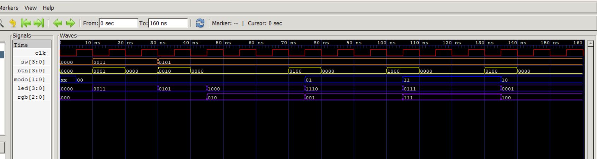
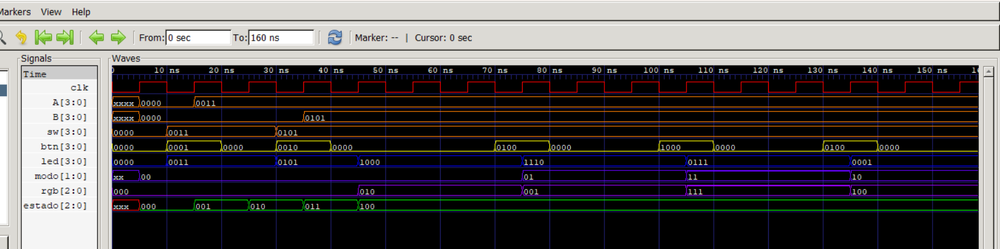

# Lab 2 - Diseño, simulación e implementación de una ALU de 4 bits

<hr style="height: 4px; border: none; background-color: #c0f0f4;">

### Integrantes 2026 - 2

**Grupo 4**

- Ana Lucía Molina López - 1061697969
- Nicolás Ramírez González - 1023371323
- Diana Margarita Castillo - 1011201869

## Índice

- [Lab 2 - Diseño, simulación e implementación de una ALU de 4 bits](#lab-2---diseño-simulación-e-implementación-de-una-alu-de-4-bits)
    - [Integrantes 2026 - 2](#integrantes-2026---2)
  - [Índice](#índice)
- [Funcionamiento del Sistema](#funcionamiento-del-sistema)
- [Arquitectura Propuesta](#arquitectura-propuesta)
- [Módulos Desarrollados](#módulos-desarrollados)
    - [Entradas y Salidas del Módulo `ALU2`](#entradas-y-salidas-del-módulo-alu2)
    - [Descripción de los Estados de la FSM](#descripción-de-los-estados-de-la-fsm)
    - [Lógica de Salida](#lógica-de-salida)
- [Forma en que se Almacenan los Operandos](#forma-en-que-se-almacenan-los-operandos)
- [Forma en que se Conserva el Código de Operación](#forma-en-que-se-conserva-el-código-de-operación)
- [Operaciones Implementadas](#operaciones-implementadas)
- [Simulación GTKWave](#simulación-gtkwave)
- [Comportamiento Observado Durante la Simulación](#comportamiento-observado-durante-la-simulación)
- [Implementación Funcional en FPGA](#implementación-funcional-en-fpga)
- [Errores](#errores)
  - [Código punto](#código-punto)


# Funcionamiento del Sistema

El sistema consiste en una **Unidad Aritmético Lógica (ALU) de 4 bits** controlada mediante una **Máquina de Estados Finitos (FSM)** de 6 estados. 

El flujo de operación es el siguiente:
1. El usuario ingresa y almacena secuencialmente dos operandos de 4 bits (`A` y `B`) utilizando los conmutadores (`sw`) y los botones de control (`btn`).
2. Una vez guardados los datos, se selecciona la operación a realizar con mutando los bits de la variable `modo` mediante botones.
3. El resultado final de la operación seleccionada se visualiza directamente en los LEDs (`led`), mientras que el LED RGB (`rgb`) indica mediante un código de colores la operación matemática o lógica que se está ejecutando.

---

# Arquitectura Propuesta

La arquitectura del sistema está compuesta por los siguientes bloques funcionales:

- **Unidad de Control (FSM):** Secuenciador secuencial de 6 estados que gestiona la captura de datos, la prevención de falsos disparos por botones y la transición del flujo de ejecución.
  
  

- **Registros de Almacenamiento:** Registros internos dedicados a mantener estables los valores de los operandos `A` (4 bits), `B` (4 bits) y el código de operación `modo` (2 bits).
- **Bloque Combinacional de la ALU:** Módulo encargado de realizar las operaciones aritméticas (suma y resta) y lógicas (AND y OR bit a bit) entre los operandos `A` y `B`.
- **Lógica de Salida y Decodificación:** Lógica combinacional que conmuta las salidas:
  - En fase de captura, conmuta los LEDs (`led`) para reflejar la posición de los conmutadores (`sw`).
  - En fase de ejecución, muestra en los LEDs el resultado calculado por la ALU y activa el color correspondiente en el LED RGB (`rgb`).

---

# Módulos Desarrollados

### Entradas y Salidas del Módulo `ALU2`

| Señal | Tipo | Ancho de Bit | Descripción |
| :--- | :---: | :---: | :--- |
| `clk` | Entrada | 1 | Reloj principal del sistema. |
| `sw` | Entrada | 4 | Conmutadores (switches) para el ingreso de datos. |
| `btn` | Entrada | 4 | Botones de control para navegación de la FSM y selección de modo. |
| `led` | Salida | 4 | LEDs para visualización de entrada en tiempo real o resultado de la ALU. |
| `rgb` | Salida | 3 | LED RGB para indicación del modo de operación seleccionado. |

---

### Descripción de los Estados de la FSM

La FSM consta de 6 estados principales gestionados en el bloque secuencial:

- **Estado 0 (`3'd0`):** Espera la pulsación de `btn[0]`. Al presionarlo, guarda el valor presente en `sw` dentro del registro `A` y avanza al Estado 1.
- **Estado 1 (`3'd1`):** Espera a que se libere `btn[0]`. Funciona como una etapa de sincronización/anti-rebote antes de pasar al Estado 2.
- **Estado 2 (`3'd2`):** Espera la pulsación de `btn[1]`. Al presionarlo, guarda el valor de `sw` dentro del registro `B` y avanza al Estado 3.
- **Estado 3 (`3'd3`):** Espera la liberación de `btn[1]` para evitar saltos indeseados, avanzando posteriormente al Estado 4.
- **Estado 4 (`3'd4`):** Estado de ejecución y selección de operación.
  - Si no se presiona `btn[0]` ni `btn[1]`, permite alternar los bits del registro `modo`: `btn[2]` conmuta el bit `modo[0]` y `btn[3]` conmuta el bit `modo[1]`.
  - Si se presiona `btn[0]` o `btn[1]`, transiciona hacia el Estado 5 para iniciar el reinicio del flujo.
- **Estado 5 (`3'd5`):** Espera a que se liberen completamente los botones `btn[0]` y `btn[1]` para reiniciar la FSM al Estado 0.

---

### Lógica de Salida

La asignación de las salidas es puramente combinacional (`always @(*)`):

- **Estados 0, 1, 2 y 3:** La salida `led` refleja en tiempo real la posición física de los switches (`led = sw`). El LED RGB permanece apagado (`rgb = 3'b000`).
- **Estados 4 y 5:** La salida `led` muestra el resultado calculado por la ALU sobre los registros `A` y `B`, según el valor guardado en `modo`. Simultáneamente, la salida `rgb` se enciende con el color asociado a la operación.

---

# Forma en que se Almacenan los Operandos

Los operandos se almacenan de forma síncrona en **registros internos tipo Flip-Flop D** de 4 bits (`reg [3:0] A` y `reg [3:0] B`). 

- La captura del **Operando A** ocurre en el **Estado 0** en el flanco de subida de reloj (`posedge clk`) cuando la señal `btn[0]` está activa (`A <= sw`).
- La captura del **Operando B** ocurre en el **Estado 2** de forma equivalente mediante la señal `btn[1]` (`B <= sw`).

---

# Forma en que se Conserva el Código de Operación

El código de operación se conserva mediante un registro interno de 2 bits (`reg [1:0] modo`).

En el **Estado 4**, la operación deseada se configura conmutando (negando) sus bits individuales mediante asignaciones no-bloqueantes síncronas al reloj:
- Presionar `btn[2]` conmuta el bit de menor peso (`modo[0] <= ~modo[0]`).
- Presionar `btn[3]` conmuta el bit de mayor peso (`modo[1] <= ~modo[1]`).

El valor se mantiene retenido en este registro hasta que se vuelva a modificar manualmente o se fuerce un reinicio de la FSM (vía bloque `default`).

---

# Operaciones Implementadas

| Operación | Expresión Verilog | Valor `modo` | Código `rgb` (`3'bRGB`) | Color LED RGB |
| :---: | :---: | :---: | :---: | :---: |
| **Suma** | `A + B` | `2'b00` (`0`) | `3'b010` | Verde (G) |
| **Resta** | `A - B` | `2'b01` (`1`) | `3'b001` | Azul (B) |
| **AND** | `A & B` | `2'b10` (`2`) | `3'b100` | Rojo (R) |
| **OR** | `A \| B` | `2'b11` (`3`) | `3'b111` | Blanco / Magenta / Cyan (RGB) |

---

# Simulación GTKWave



[Codigo simulación](codigos/códigos/TBALU2.v)

---

# Comportamiento Observado Durante la Simulación



> En la forma de onda se observa el proceso de captura de los operandos `A` y `B`, cuyos valores cargados mediante los switches (`sw`) se visualizan en el bus `led[3:0]`. Posteriormente, se evidencia cómo la FSM transiciona de estado mediante los pulsos de los botones `btn[2]` y `btn[3]`, modificando de forma secuencial el registro `modo[1:0]` (operaciones Suma 00, Resta 01, OR 11 y AND 10). A su vez, el LED RGB (`rgb[2:0]`) actualiza su color para reflejar la operación activa en cada intervalo.


---

# Implementación Funcional en FPGA


[Video con la demostración](https://drive.google.com/file/d/1BL0Tof1RyYyNOwMiS0ND_HPc_P3cV5ED/view?usp=sharing "Video, entrar con el correo institucional")
> Video del funcionamiento.

# Errores

Al implementar la ALU en la FPGA con la señal de reloj principal del sistema, se observaron breves destellos indeseados (glitches) en el led RGB las transiciones de estado. Este fenómeno ocurre porque la FSM evalúa las entradas de los botones (btn) en cada flanco activo sin un mecanismo de sincronización o filtrado previo. Dado que los pulsadores mecánicos generan múltiples oscilaciones metálicas al ser presionados (efecto rebote), la FSM a alta frecuencia interpreta estas vibraciones como múltiples pulsaciones consecutivas en cuestión de microsegundos, causando saltos de estado imprevistos y estados transitorios visibles en los LEDs.

En la simulación con Icarus Verilog y GTKWave, aunque no existe el rebote mecánico, se presentó una limitación estricta debido a la estructura jerárquica de la FSM y la duración de los estímulos para alcanzar el registro `modo = 11` (OR). En el Estado 4, la conmutación de los bits de modo se realiza mediante asignaciones no bloqueantes (<=) condicionadas por una cadena `else-if`:   

```Verilogelse 
if (btn[2]) modo[0] <= ~modo[0];
else if (btn[3]) modo[1] <= ~modo[1];
```

Si el pulso asignado a `btn[3]` en el testbench permanece activo durante más de un ciclo completo de reloj, la FSM vuelve a evaluar y negar la señal modo[1] en el siguiente flanco ascendente, provocando que el registro regrese inmediatamente de 11 a 01 antes de poder estabilizarse y graficarse. 

La solución en el entorno de simulación consistió en estructurar el testbench utilizando bloques temporales exactos (`#10` o `@(posedge clk)` seguidos de la limpieza inmediata del bus btn = 4'b0000), garantizando que cada botón se active durante un único flanco de reloj y permitiendo la acumulación limpia de los bits hasta obtener el modo 11 y posteriormente el 10.   


## Código punto 
```verilog
// Módulo ALU2: Unidad Aritmético Lógica de 4 bits controlada por una Máquina de Estados Finitos (FSM)
module ALU2 (
    input clk,          // Reloj del sistema
    input [3:0] sw,     // Interruptores de entrada (para ingresar operandos A y B)
    input [3:0] btn,    // Botones de control (transición de estados y cambio de modo)
    output reg [3:0] led, // Salida de LEDs (muestra switches o resultado de la operación)
    output reg [2:0] rgb  // Salida para LED RGB (indica la operación actual)
);
    // Registros internos de la máquina de estados y operandos
    reg [2:0] estado; // Estado actual de la FSM (0 a 5)
    reg [3:0] A;      // Registro para el primer operando
    reg [3:0] B;      // Registro para el segundo operando
    reg [1:0] modo;   // Selector de operación ALU (0: Suma, 1: Resta, 2: AND, 3: OR)

    // Lógica secuencial (FSM): Captura de operandos, cambio de modo y transición de estados
    always @(posedge clk) begin
        case (estado)
            // Estado 0: Espera la pulsación de btn[0] para capturar el operando A desde los switches
            3'd0: if (btn[0]) begin
                A <= sw;
                estado <= 3'd1;
            end
            
            // Estado 1: Anti-rebote/espera a que se libere btn[0]
            3'd1: if (!btn[0]) estado <= 3'd2;
            
            // Estado 2: Espera la pulsación de btn[1] para capturar el operando B desde los switches
            3'd2: if (btn[1]) begin
                B <= sw;
                estado <= 3'd3;
            end
            
            // Estado 3: Anti-rebote/espera a que se libere btn[1]
            3'd3: if (!btn[1]) estado <= 3'd4;
            
            // Estado 4: Modo de ejecución / Selección de operación
            // - Presionar btn[0] o btn[1] avanza al estado 5 para reiniciar el flujo.
            // - Presionar btn[2] conmuta el bit inferior de modo (modo[0]).
            // - Presionar btn[3] conmuta el bit superior de modo (modo[1]).
            3'd4: if (btn[0] | btn[1]) estado <= 3'd5;
                else if (btn[2]) modo[0] <= ~modo[0];
                else if (btn[3]) modo[1] <= ~modo[1];
            
            // Estado 5: Espera a que se liberen btn[0] y btn[1] para reiniciar la FSM al estado 0
            3'd5: if (!(btn[0] | btn[1])) estado <= 3'd0;
            
            // Estado por defecto: Reinicia las señales si ocurre un estado inválido
            default: begin
                estado <= 0;
                A <= 0;
                B <= 0;
                modo <= 0;
            end
        endcase
    end

    // Lógica combinacional: Salidas para los LEDs y el LED RGB según el estado y el modo
    always @(*) begin
        rgb = 0; // Valor por defecto del RGB
        case (estado)
            // En los estados 0 a 3, los LEDs reflejan directamente la posición actual de los switches
            3'd0, 3'd1, 3'd2, 3'd3: led = sw;
            
            // En los estados 4 y 5, los LEDs muestran el resultado de la ALU según 'modo'
            3'd4, 3'd5: begin
                case (modo)
                    2'd0: begin // Operación: Suma (A + B)
                        led = A+B;
                        rgb = 3'b010; // Color RGB para Suma
                    end
                    2'd1: begin // Operación: Resta (A - B)
                        led = A-B;
                        rgb = 3'b001; // Color RGB para Resta
                    end
                    2'd2: begin // Operación: AND bit a bit (A & B)
                        led = A&B;
                        rgb = 3'b100; // Color RGB para AND
                    end
                    2'd3: begin // Operación: OR bit a bit (A | B)
                        led = A|B;
                        rgb = 3'b111; // Color RGB para OR
                    end
                    default: begin
                        led = A+B;
                        rgb = 3'b010;
                    end 
                endcase
            end
            
            // Estado por defecto para la lógica combinacional de salida
            default: begin
                led = 0;
                rgb = 0;
            end
        endcase
    end
endmodule
```

